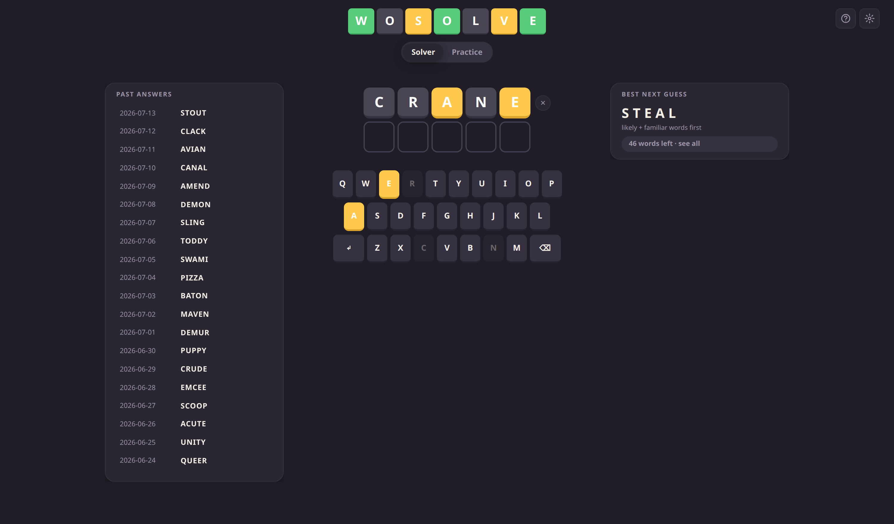
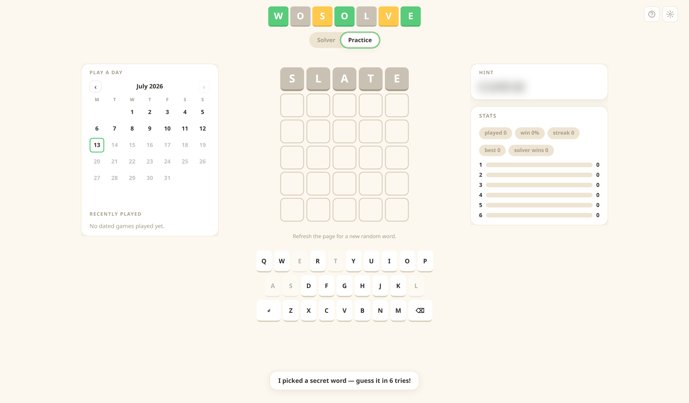
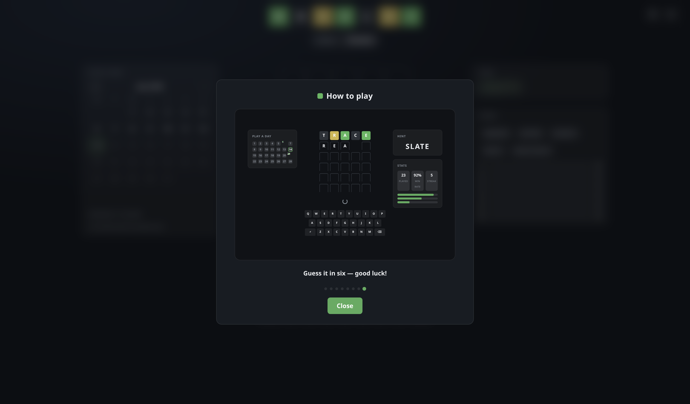
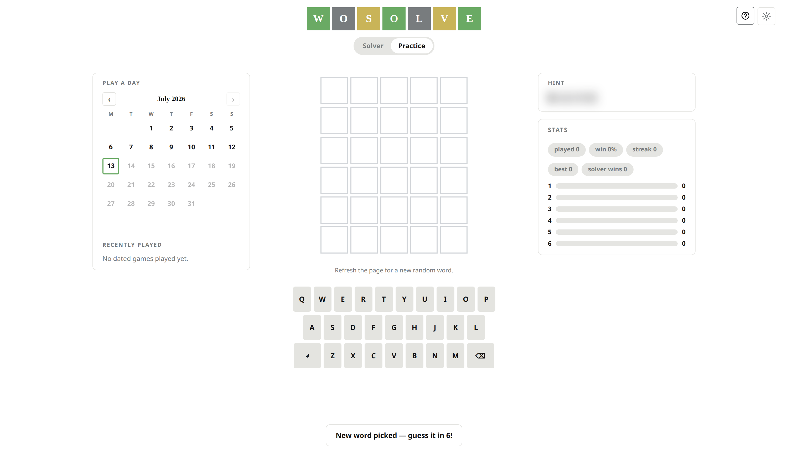
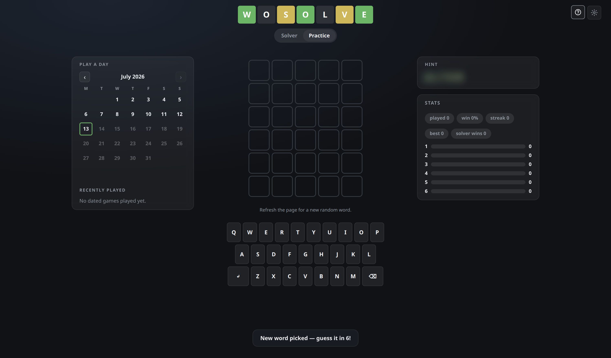
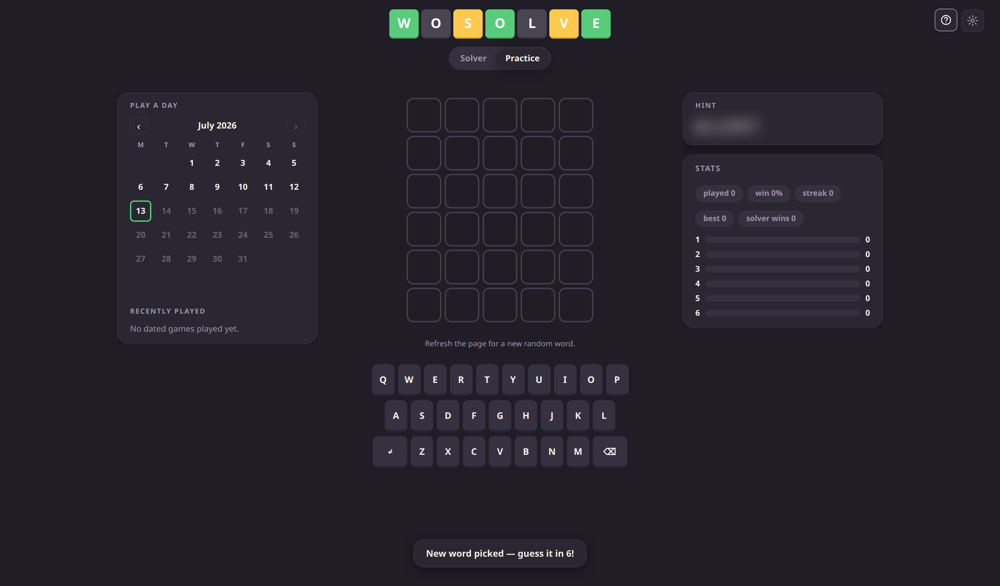

# WoSolve

[](https://github.com/vlah02/wosolve/actions/workflows/ci.yml)
[](LICENSE)

A modern **Wordle solver and practice trainer** that runs entirely in your browser. Feed it the colors from your daily Wordle and it ranks the best next guesses in real time — or flip to Practice mode and play full games against a secret word, with hints, stats, and any historical puzzle from a themed calendar.

Three switchable skins, full light/dark theming, and an animated walkthrough that teaches the whole interface.



---

## Contents

- [What it does](#what-it-does)
- [Screenshots](#screenshots)
- [How it works](#how-it-works)
- [Running it locally](#running-it-locally)
- [Deployment](#deployment)
- [Project layout](#project-layout)
- [Regenerating the data](#regenerating-the-data)
- [Testing](#testing)
- [Contributing](#contributing)
- [License](#license)

---

## What it does

### Solver mode
- **Type your real Wordle guess**, then set each tile's color the way Wordle showed it — click a tile to cycle gray → yellow → green, use the arrow keys, or press `1`/`2`/`3`. Press `Enter` to submit.
- The candidate list narrows instantly and a **ranked "best next guess"** appears, with a full bar-chart list of remaining words (fuller bar = the guess that narrows the field more).
- **Frequency-blended ranking**: suggestions favor real, familiar words rather than obscure optimizer picks — which research shows costs almost nothing in solve efficiency while making the recommendations usable.
- The on-screen keyboard **colors itself** from everything you've entered (known-position green, present-but-misplaced yellow, excluded dimmed).
- **Past answers** are listed alongside — every previous day's Wordle solution. Since answers never repeat, these are automatically ruled out.
- Made a mistake? **Hover any submitted row and hit ×** to remove just that guess; everything recomputes.

### Practice mode
- The app picks a secret word and you play a full six-guess game right here, colors filling in automatically.
- **Smart hints** that always share at least one correctly-placed letter with the answer.
- **Play any historical puzzle** from a themed in-app calendar (every daily Wordle from June 2021 onward), or refresh the page for a fresh random word.
- **Post-solve analysis**: a per-guess breakdown of how many candidates each guess eliminated, compared against what the solver would have played — framed encouragingly, never judgmentally.
- **Local stats**: games played, win rate, current/best streak, and a guess distribution — all stored in your browser.

### Everywhere
- **Three skins** — Board (newspaper minimalism), Signal (glassy dev-tool), Arcade (chunky and playful) — each with its own motion language, in light and dark.
- **Animated "How to play"** — a camera-driven walkthrough that tours every part of the UI, different for each mode.
- Runs with **no page reloads**, works **offline** after first load, and is responsive down to 360px-wide phones.

---

## Screenshots

| Solver | Practice |
| --- | --- |
|  |  |

**Animated "How to play" walkthrough**



**Skins** — Board, Signal, Arcade

|  |  |  |
| --- | --- | --- |

---

## How it works

WoSolve is a single-page app. **All game logic runs in the browser** — Flask only serves the page and static files. There is no database and no server-side session; everything you do lives in `localStorage`.

**The solver.** [`static/js/solver.js`](static/js/solver.js) filters the word list against your accumulated constraints and ranks the survivors. Ranking is two-phase: while many candidates remain it maximizes information (distinct-letter frequency coverage across the candidate set); once the field is small it switches to likelihood (favoring actual answer words). Real-world word frequency (from the Google Books/Norvig corpus) breaks ties so familiar words rise to the top.

**Correctness is guaranteed by a reference implementation.** [`solver_ref.py`](solver_ref.py) is the original Python solver, kept as the source of truth. [`scripts/gen_test_vectors.py`](scripts/gen_test_vectors.py) runs it over hundreds of game scenarios and writes the expected results to [`static/data/test-vectors.json`](static/data/test-vectors.json). The JavaScript port is then checked against those 264 vectors — both in the browser ([`static/tests.html`](static/tests.html)) and headlessly ([`tests/run_js_vectors.js`](tests/run_js_vectors.js)) — so the two implementations can never silently drift apart.

**Data is precomputed, not fetched at runtime.** Word lists (2,315 answers + 10,657 extended), the 1,851-entry dated answer history, and per-word frequency tiers all ship as static JSON generated by scripts in [`scripts/`](scripts/).

**The UI is token-driven.** [`static/css/tokens.css`](static/css/tokens.css) defines every color, radius, shadow, font, and motion curve as CSS custom properties; the three skins × two themes are just different token values selected by `data-skin`/`data-theme` on `<html>`. Components reference only tokens, so a skin swap restyles the whole app with no reload.

**Tech stack:** Python 3 + Flask (thin server), vanilla ES-module JavaScript (no build step), Tailwind (self-hosted, utility classes) plus the custom token system, and `gjs` for headless JS testing.

---

## Running it locally

You need **Python 3.10+**. No Node, npm, or build step is required to run the app.

```bash
# 1. Clone
git clone https://github.com/vlah02/wosolve.git
cd wosolve

# 2. Create a virtual environment
python3 -m venv venv
source venv/bin/activate          # Windows: venv\Scripts\activate

# 3. Install dependencies
pip install -r requirements.txt

# 4. Run
python app.py
```

Then open **http://localhost:5000**.

The server runs in debug mode, so edits to templates, CSS, or JavaScript are picked up on the next browser refresh.

**Play from your phone** on the same network — bind to all interfaces and visit your computer's LAN IP at port 5000:

```bash
flask --app app run --host 0.0.0.0
```

> **Tip:** Open **How to play** (the `?` button, top-right) for an animated tour of the whole interface — it's different in Solver and Practice mode.

---

## Deployment

`python app.py` runs Flask's development server, which is fine locally but not for public hosting. For production the app is served with [gunicorn](https://gunicorn.org/) (a `Procfile`, `Dockerfile`, and `render.yaml` are included).

**Docker** — self-contained, runs anywhere:

```bash
docker build -t wosolve .
docker run -p 8000:8000 wosolve      # http://localhost:8000
```

**Any Procfile host** (Render, Railway, Heroku-likes) — the included `Procfile` runs `gunicorn app:app`. On Render specifically you can point a **Blueprint** at the repo and the bundled `render.yaml` provisions a free web service automatically.

**Manually** on any server:

```bash
pip install -r requirements.txt
gunicorn app:app --workers 2 --bind 0.0.0.0:8000
```

There's no database, no secrets, and no build step, so any static-friendly Python host works.

---

## Project layout

```
wosolve/
├── app.py                    # Flask app — serves the single page
├── solver_ref.py             # Reference solver (source of truth for tests)
├── requirements.txt
├── templates/
│   └── index.html            # The single page shell
├── static/
│   ├── js/
│   │   ├── solver.js         # Constraint filtering + ranked suggestions (pure logic)
│   │   ├── game.js           # Solver & practice game state, localStorage
│   │   ├── ui.js             # Board, keyboard, suggestions, toasts rendering
│   │   ├── settings.js       # Skin / theme / word-list settings
│   │   ├── calendar.js       # Themed play-a-day calendar
│   │   ├── stats.js          # Practice stats + distribution
│   │   ├── analysis.js       # Post-solve per-guess breakdown
│   │   ├── helpdemo.js       # Camera-driven animated "How to play" tour
│   │   ├── celebrate.js      # Per-skin solve celebrations
│   │   └── main.js           # Boot / wiring
│   ├── css/
│   │   ├── tokens.css        # 3 skins × 2 themes design tokens
│   │   ├── components.css    # Token-driven component styles
│   │   └── layouts.css       # Command-center grid + responsive stacking
│   ├── data/                 # Generated JSON (word lists, freq, past answers, test vectors)
│   └── tests.html            # In-browser JS↔Python equivalence test runner
├── scripts/                  # Data generators (see below)
├── tests/
│   ├── test_solver.py        # Python reference test suite
│   └── run_js_vectors.js     # Headless JS equivalence runner (gjs)
└── words/                    # Raw source word lists
```

---

## Regenerating the data

The JSON files in `static/data/` are committed, so you don't need to regenerate them to run the app. If you change the solver or want to refresh the sources, run the generators from the project root:

```bash
python scripts/gen_wordlists.py       # words/*.txt      -> answers.json, extended.json
python scripts/gen_wordfreq.py        # Norvig corpus    -> freq.json (per-word frequency tiers)
python scripts/gen_past_answers.py    # public archive   -> past-answers.json (dated history)
python scripts/gen_test_vectors.py    # solver_ref.py    -> test-vectors.json (test fixtures)
```

`gen_wordfreq.py` and `gen_past_answers.py` fetch from the network and fail loudly (writing nothing) if a source is unavailable. **After changing the solver, always rerun `gen_test_vectors.py`** so the fixtures match — the test suite enforces this.

---

## Testing

**Python reference suite** (soundness sweep, duplicate-letter edge cases, ranking, and a check that the committed vectors are reproducible):

```bash
python tests/test_solver.py
```

**JavaScript ↔ Python equivalence** — proves the browser solver matches the reference on all 264 vectors:

- In a browser: run the app and open <http://localhost:5000/static/tests.html>
- With Node: `node tests/run_js_vectors.mjs`
- With [`gjs`](https://gitlab.gnome.org/GNOME/gjs): `gjs -m tests/run_js_vectors.js`

Both should report **ALL … PASS**. Both the Python suite and the Node vector runner also run automatically on every push and pull request via [GitHub Actions](.github/workflows/ci.yml). There's no build step, so these suites plus a quick manual pass across skins/themes are the full check.

The dated answer history is kept fresh by a scheduled workflow ([`refresh-data.yml`](.github/workflows/refresh-data.yml)) that re-runs the generator weekly and commits any changes.

---

## Contributing

Contributions are welcome — bug reports, fixes, new skins, and features all.

1. **Open an issue** describing the change so we can agree on the approach before you invest time.
2. **Fork and branch** off `main` (e.g. `git checkout -b my-feature`).
3. **Make the change.** A few conventions worth following:
   - Any change to solving logic must be made in **both** `solver_ref.py` and `static/js/solver.js`, and you must rerun `python scripts/gen_test_vectors.py` so the fixtures match.
   - Style through the **design tokens** — reference `var(--…)` custom properties rather than hard-coding colors, so every skin and theme keeps working.
   - Animations should use **`transform`/`opacity` only** (compositor-friendly, 60fps) and must respect `prefers-reduced-motion`.
   - Keep the accessibility floor: visible keyboard focus, ≥40px touch targets on mobile, and no horizontal scroll down to 360px.
4. **Run the tests** (`python tests/test_solver.py` and the JS vectors) and sanity-check the UI in a couple of skins/themes.
5. **Open a pull request** linking the issue. Screenshots are appreciated for anything visual.

---

## License

Released under the [MIT License](LICENSE) — free to use, modify, and distribute.

Word lists are derived from the public Wordle answer/allowed lists; word-frequency data derives from the Google Books Ngram corpus via Peter Norvig's `count_1w` dataset. WoSolve is an independent project and is not affiliated with or endorsed by The New York Times.
